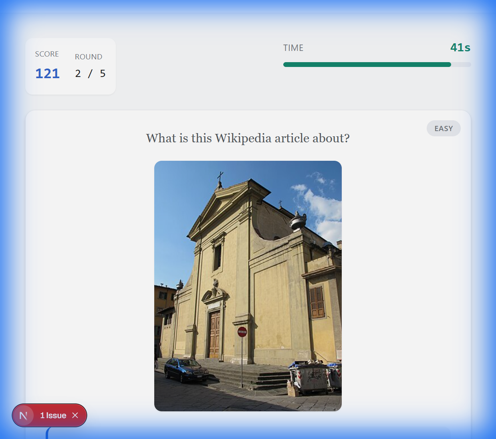
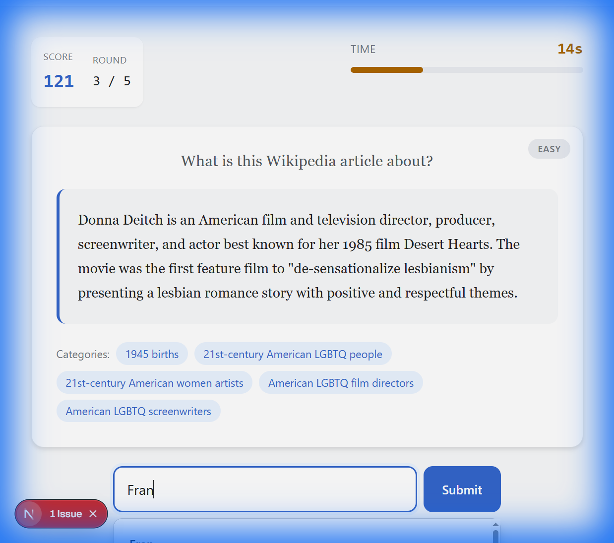
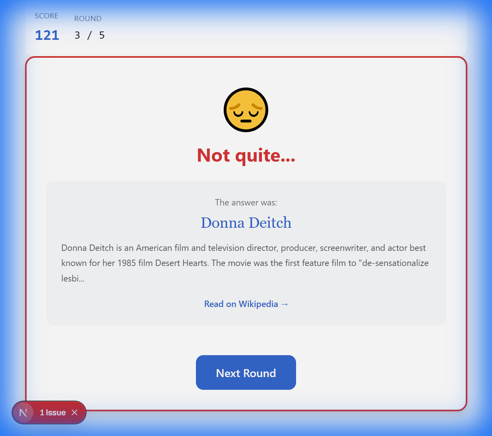

# Wiki Guesser - MVP Walkthrough

## What Was Built

A fully functional single-player trivia game where players guess Wikipedia article topics from their content.

### Core Features

| Feature | Status |
|---------|--------|
| Landing page with difficulty selection | ✅ |
| Wikipedia API integration | ✅ |
| Autocomplete guess input | ✅ |
| Countdown timer | ✅ |
| Scoring with time bonus & streaks | ✅ |
| Round results with score breakdown | ✅ |
| Game over screen with stats | ✅ |

---

## Project Structure

```
wiki-guesser/
├── src/
│   ├── app/
│   │   ├── page.tsx              # Landing page
│   │   ├── page.module.css
│   │   ├── layout.tsx
│   │   └── play/single/          # Game page
│   ├── components/game/          # Core game UI
│   │   ├── GameBoard.tsx
│   │   ├── Timer.tsx
│   │   ├── GuessInput.tsx
│   │   ├── ScoreDisplay.tsx
│   │   └── RoundResult.tsx
│   ├── hooks/
│   │   └── useGame.ts            # Game state management
│   ├── lib/
│   │   ├── wikipedia.ts          # API integration
│   │   └── scoring.ts            # Score calculations
│   ├── styles/
│   │   ├── globals.css           # Design system
│   │   └── variables.css         # CSS tokens
│   └── types/
│       └── index.ts              # TypeScript types
```

---

## Screenshots

### Game Board with Content


### Autocomplete Feature  


### Result Screen


---

## How to Run

```bash
cd wiki-guesser
npm install
npm run dev
```

Open [http://localhost:3000](http://localhost:3000)

---

## Next Steps (Future Phases)

- **Phase 2**: User accounts with Supabase Auth
- **Phase 3**: Leaderboards (global, daily, friends)
- **Phase 4**: Multiplayer (real-time and async)
- **Phase 5**: Achievements, PWA, social sharing
